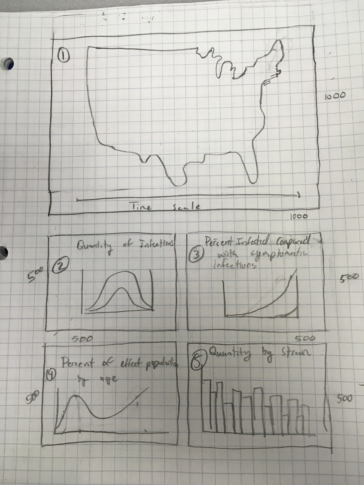
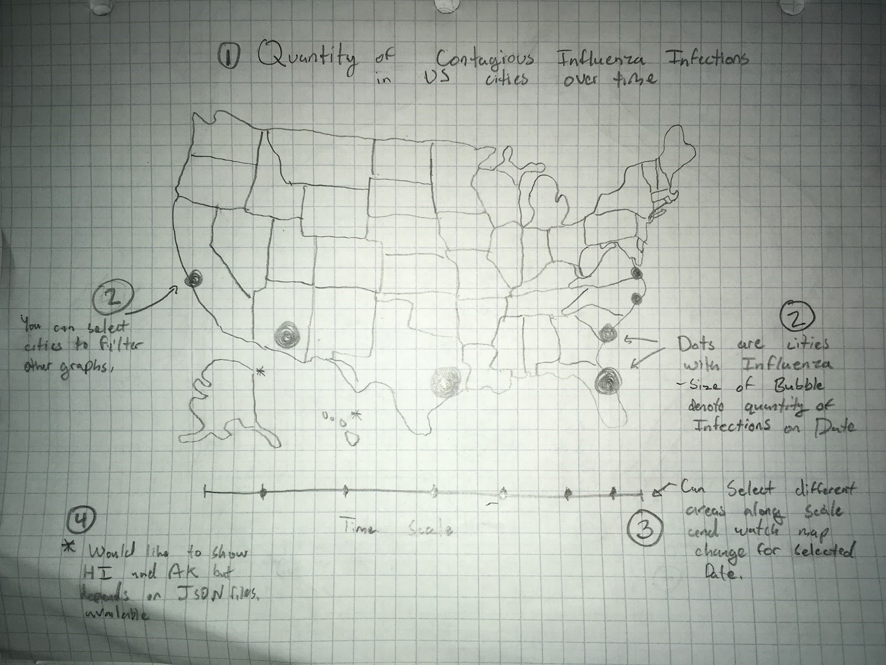
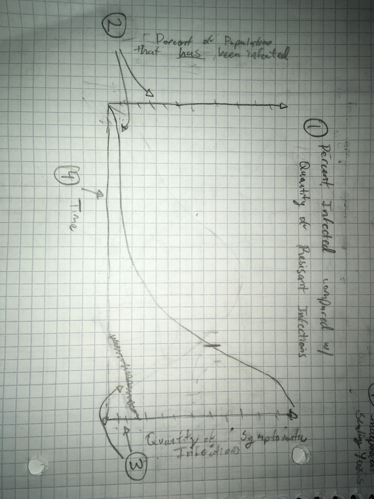
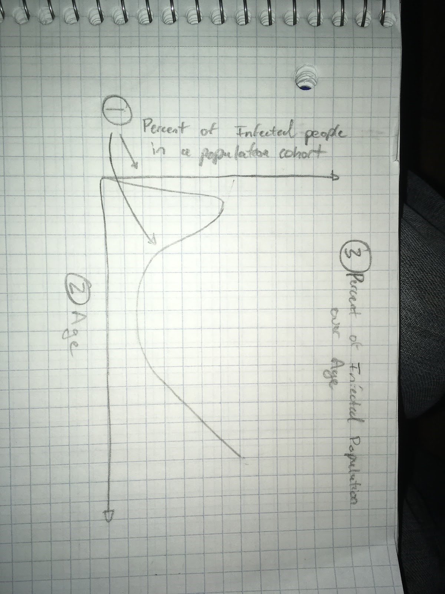
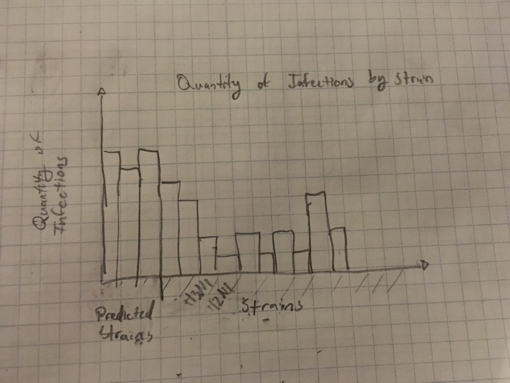

# DataVisInfluenza
Data Vis Final Jacob Moon and Virginia Nunez

Create a proposal document addressing the following points. Use the points as headers in your document. Each team member must push this document into his/her homework directory. As a ballpark number: your proposal should contain about 3-4 pages of text, plus 5-6 pages of sketches.

Basic Info. The project title, your names, e-mail addresses, GitHub ids, a link to the project repository (I encourage you to make it a public repo).

Title: something along the lines of “Influenza ….”
Jacob Moon:
	Email: jamoon@wpi.edu
	Github id: Yeknomo
Virginia Nunez Mir:
	Email: vcnunez@wpi.edu
	Github id: vcnunezmir
	
GitHub repo: https://github.com/vcnunezmir/DataVisInfluenza
	
Background and Motivation. Discuss your motivations and reasons for choosing this project, especially any background or research interests that may have influenced your decision.

We are both bioinformatic students, so we knew we wanted to work on something bio related. Influenza is such a widespread disease that there is a wealth of information out there to be explored. Furthermore, the database on the influenza virus shows connections between many species, and we found a lot of interest, as well as potential, in it.

Project Objectives. Provide the primary questions you are trying to answer with your visualization. What would you like to learn and accomplish? List the benefits.

What are the connections between the locations of certain birds known to transmit influenza, and known human influenza patients?
Are there any noticeable connections between strains and their characteristics?
Are there any noticeable connections between the spread of influenza and the characteristics of the spreading strains?

Data. From where and how are you collecting your data? If appropriate, provide a link to your data sources.

Datasets: https://www.fludb.org/brc/search_landing.spg?decorator=influenza 

Most, if not all of our data is going to come from the Influenza Research Database. The page includes many different datasets, including animal surveillance data, data on influenza strains, and data on human isolates of the influenza virus. Our visualizations will be composed of combinations of the different datasets found in this site. For example, one of the graphs might use just the information from the human isolates dataset, comparing one attribute to another. A different graph might compare one attribute from the human isolates to the same attribute in the animal surveillance dataset. Yet another graph could compare attributes from the human isolate dataset, such as strain, to information obtained about the strain from the strain dataset.
  
Mapping the states: http://eric.clst.org/Stuff/USGeoJSON 

This is a GeoJSON file for constructing a map of the Us with all of the States in it. It will also be used to create a projection of all latitudes and longitudes on the SVG, this will then be used to incorporate cities into our mapping. 
  
Mapping the cities: https://www.maxmind.com/en/free-world-cities-database

This is a csv of city names, populations, latitudes, and longitudes. This data will be used to put the cities onto our map projection. 
Data Processing. Do you expect to do substantial data cleanup? What quantities do you plan to derive from your data? How will data processing be implemented?

Due to all of our data being spread across different datasets, a necessary aspect of our project will be to sift through all of the different datasets and compile the important information from each. There probably will not be any calculations involved during data processing, considering most of the data we are interesting is qualitative and categorical. However, any calculations will probably be made in excel before importing the file into d3.
  
Visualization Design. How will you display your data? Provide some general ideas that you have for the visualization design. Develop three alternative prototype designs for your visualization. Create one final design that incorporates the best of your three designs. Describe your designs and justify your choices of visual encodings. We recommend you use the Five Design Sheet Methodology.
This is the organization of the visualization page of our program. It will feature 5 major visualizations which will each be covered below. Each graphic will have it’s own SVBG container and may be linked with the other graphics, to work together. 

This is the main graphic for the project it is a map of the US with the different states. (1) The map will have each the states as a default tan color or a red color for infected states, as time goes by circles are added to the map to represent active contagious infections. An active contagious infection is either seven days after diagnosis or 14 days if the person is a child or elderly. (2) The size of the circles will display the quantity of infections and will be placed on the cities the infections take place in. The circles can be selected to filter the other four graphs by city that was selected. (3) On the bottom on the chart will will be a time selector, will have increments of months and a play button for the program to iterate through the days of the month. The goal of this map will be to show the flu “travel” throughout the US as time goes by populating across cities in a wave. 

How to make this graphic:
We will first need to make a dataset of all infections, containing Latitude, Longitude, Start of Infection date, End of infection date, City name, state, and Strain Subtype. Then we will set a start time for the graphic, which will have no infections. Upon starting the program, it will iterate through a new day each second. Or the user can select a month on the graphic and it will display the flu infections for the first day of the month. Then the graphic can be played from that day on.  Calculating and iterating dates may be a challenge so to simplify it, we are going to convert the dates to numbers then increment and compare to filter the dataset. This process is explained in the following notes. 

This is the second graphic for our program. It supposed to show the quantity of human infections over time on one line and quantity of animal infections overtime on the second line. This will be used to ho show a correlation between the animal infection rate and the human infection rate. To produce this graphic all we will need to is create a dataset for humans and  a second dataset for animals each containing dates and quantities of active infections for the dates.

This is the third graphic for our program. It is supposed to show the percent of the city population that has been infected as one line, and another line displaying quantity of symptomatic infections. Both of these lines will be displayed over time. This graphic is intended to show that as a higher percentage of the population is infected, those that are infected are immunocompromised and therefore have a higher symptom rate. To produce this graph, we will need two datasets, one with percent of population that has been infected and dates, and the other with dates and counts of those with symptoms. 

This graph is going to require a lot of filtering and therefore is explained in the following notes. 

This is the fourth graphic in our program. It is meant to show a line graph of infected population percent of an age cohort over age. Meaning, we will use an average us census percentage for what percent of the population each age cohort is. Then using we will take those percents and multiply them by the population, to receive the population of each age cohort in a selected grouping (city, state, overall). Then we count infected population of an age and divide the counts by our estimated age cohort population. Therefore, the graph is what percentage of each age group got infected. This will show that higher percentages of immunocompromised populations (elderly and children) become infected with the flu. 

This is the fifth graphic for our program. It will show the quantity of those infected by strain. We will highlight and order all of the predicted strains first. We will use the CDC annual strain prediction for producing the vaccines for these. The goal of this is to show what strains actually infect the most people, and how well the CDC prediction holds up, or is affected by the vaccine deployment. This graph will be relatively easy to produce because all we need to do is count the number of infections by strain. 

Must-Have Features. List the features without which you would consider your project to be a failure.
	Interactivity in our graphs that gives you more information about the specific cases. A demonstration of the cases along a timescale. A map of the location of the cases.
  
Optional Features. List the features which you consider to be nice to have, but not critical.
	Mapping of the birds’ locations. Having the graphs update based on what you are doing with each of them (similar to Assignment 4).
  
Project Schedule. Make sure that you plan your work so that you can avoid a big rush right before the final project deadline, and delegate different modules and responsibilities among your team members. Write this in terms of weekly deadlines.
	Week of Feb 13: Have general outline of code written out
	Week of Feb 20: Have a working prototype
	Week of Feb 27: Make changes and final tweaks and improvements

